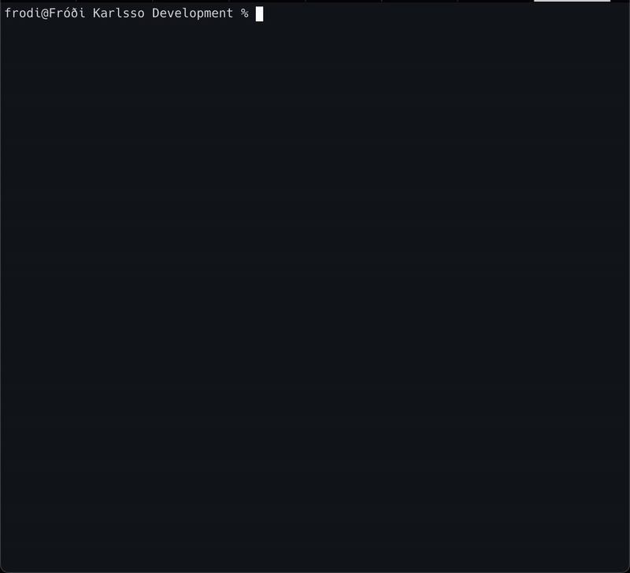

# Workshed

Intent-scoped local development workspaces. Group multiple Git repositories into a clean, disposable directory for focused tasks.

## Why Workshed?

`git worktree` manages branches of a single repo. Workshed groups multiple repos for a task.

Each workspace:
- Has a required purpose
- Contains one or more Git repositories
- Lives in its own directory
- Uses a random handle (e.g., `aquatic-fish-motion`)
- Is disposable — delete when done

No daemon, no database. State is the filesystem.

## Workshed + AI

Workshed works great with AI assistants. Each workspace is an isolated context with clear boundaries—perfect for task-focused agents.

Start Workshed as an MCP server for Claude Desktop, Cursor, or any MCP-compatible assistant:

```bash
workshed mcp
```

AI assistants can then:
- **Create workspaces** with specific purpose and repositories
- **Execute commands** across multiple repos in parallel
- **Capture git state** before making changes, restore when needed
- **Export/import** workspace definitions for reproducibility

Example MCP config:

```json
{
  "mcpServers": {
    "workshed": {
      "command": "workshed",
      "args": ["mcp"]
    }
  }
}
```

Watch an agent fix an upstream dependency with Workshed MCP. No impact on the current diff, zero friction:


The Workshed TUI for local development. Keyboard-driven, focused, and fast:



## Quick Start

```bash
# Create a workspace
workshed create --purpose "Debug payment timeout" \
  --repo github.com/org/service@main \
  --repo ./local-lib

# Run commands across all repos
workshed exec -- make test

# Capture git state before making changes
workshed capture --name "Before refactor"

# Restore that state later
workshed apply --name "Before refactor"

# Clean up
workshed remove
```

## Commands

| Command | Description |
|---------|-------------|
| `workshed` | Open interactive TUI dashboard |
| `workshed create` | Create a new workspace (--repo, --template, --map, --depth) |
| `workshed list` | List workspaces (--purpose, --page) |
| `workshed inspect` | Show workspace details |
| `workshed path` | Print workspace path |
| `workshed update` | Update workspace purpose |
| `workshed remove` | Delete a workspace (--dry-run, --yes) |
| `workshed exec` | Run command in repos (--all, --repo) |
| `workshed capture` | Record git state snapshot (--name, --description, --tag) |
| `workshed captures` | List captures (--filter, --reverse) |
| `workshed apply` | Restore git state (--name, --dry-run) |
| `workshed export` | Export workspace (--compact) |
| `workshed import` | Create workspace from JSON (--file, --preserve-handle, --force) |
| `workshed health` | Check workspace health |
| `workshed repos list` | List repositories |
| `workshed repos add` | Add repository (--repo, --depth) |
| `workshed repos remove` | Remove repository (--repo, --dry-run) |
| `workshed mcp` | Run as MCP server for AI assistants |
| `workshed --version` | Show version |

Run `workshed <command> --help` for details.

## Create Options

```bash
# Clone specific ref
workshed create --purpose "Task" --repo github.com/org/repo@feature

# Shallow clone (faster for large repos)
workshed create --purpose "Task" --repo github.com/org/large-repo::10
workshed create --purpose "Task" --repo github.com/org/repo@main::5  # shallow with ref

# From template with variables
workshed create --purpose "New app" \
  --template ~/templates/react \
  --map name=myapp \
  --map env=production
```

## State Management

Captures record git state (commit, branch, dirty status). They're **descriptive snapshots**, not authoritative checkpoints.

```bash
# Capture before changes
workshed capture --name "Before refactor" --description "API change point"

# List captures
workshed captures
workshed captures --filter api        # by name
workshed captures --filter tag:debug  # by tag

# Apply (restore git state from capture)
workshed apply --name "Before refactor"
workshed apply 01HVABCDEFG            # by ID
```

Export/import for sharing workspaces:

```bash
workshed export > workspace.json
workshed import workspace.json --preserve-handle
```

## Output Formats

Most commands support `--format table|json|raw`:

```bash
workshed list --format json
workshed captures --format raw | jq -r '.[].name'
workshed export --compact --format json | jq '{purpose, repositories}'
```

Set `WORKSHED_LOG_FORMAT=json` for fully non-interactive output.

## Environment

| Variable | Description |
|----------|-------------|
| `WORKSHED_ROOT` | Workspace directory (default: `~/.workshed/workspaces`) |
| `WORKSHED_LOG_FORMAT` | Log format: `human`, `json`, `raw` |

## Install

```bash
brew tap frodi-karlsson/homebrew-tap
brew install workshed
```

## What Workshed Is Not

- A permanent monorepo solution
- A build or dependency manager
- A CI/CD system
- A Git wrapper or branch manager
- A background service

It only manages directories and runs commands you provide.

## Development

See [docs/architecture/](docs/architecture/) for details.

| Task | Command |
|------|---------|
| Build | `make build` |
| Test | `make test` |
| Lint | `make lint` |
| Full check | `make check` |